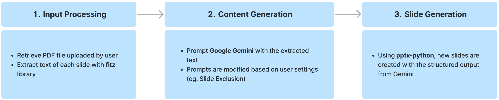

<div align="center">

# Boring-Slide-Eradicator-inator

A Gemini-powered tool that transforms confusing lecture slides into clear and engaging material, making **learning easier for students**.

Proudly created for the Google AI Hackathon 2024.

[Installation](#installation) •
[How To Use](#how-to-use) •
[How It Works](#how-it-works) •
[Demo](#demo) •
[About Us](#about-us)


</div>

## Installation

To get the Boring-Slide-Eradicator-inator up and running on your machine, follow these steps:

1. **Clone the Repository:**
     ```bash
     git clone https://github.com/munirrudy-sg/Boring-Slide-Eradicator-inator.git
     cd Boring-Slide-Eradicator-inator
     ```

2. **Install Dependencies:**
     ```bash
     pip install -r requirements.txt
     ```

3. **Run the Application:**
     ```bash
     streamlit run main.py
     ```

4. **Verification of Installation:**
   - Navigate to `http://localhost:8501` in your web browser to view the app. If everything is set up correctly, you should see the Boring-Slide-Eradicator-inator interface.

## How To Use

To effectively utilise the Boring-Slide-Eradicator-inator, follow these straightforward steps after installation:

1. **Import Your PDF Files:**
   - Begin by importing the PDF files containing the lecture slides you wish to transform.

2. **Key In Citations (Optional):**
   - If you have specific citations or sources you want referred to during the slide explanation, key them in at this stage.

3. **Exclude Unnecessary Slides (Optional):**
   - Optionally, you can choose to exclude title pages, "thank you" slides, and any other slides that do not require explanation. This helps focus the transformation on content-rich slides.

4. **Choose Your Theme:**
   - Select a preferred visual style or theme for the output. 

5. **Process PDF:**
   - Once you’ve configured the settings, click on "Process PDF" to start transforming your slides into clear and engaging material.

If you're unsure about any step, don't worry as there are detailed instructions are also provided within the app itself, guiding you through each part of the process.

## How It Works

The Boring-Slide-Eradicator-inator utilises `google.generativeai` for processing, `streamlit` for user interaction and `pptx-python` to create slides. Here’s how the transformation process works:



## Demo
Check out the Boring-Slide-Eradicator-inator in action:

[](https://www.youtube.com/watch?v=Ju8Hr50Ckwk)

## About Us

Meet the team behind the Boring-Slide-Eradicator-inator:

- **Ang Jun Jie** ([LinkedIn](https://www.linkedin.com/in/ang-jun-jie-49a827174/) | [GitHub](https://github.com/buppanasu))
- **Munir Rudy Herman** ([LinkedIn](https://www.linkedin.com/in/munirrudy) | [GitHub](https://github.com/munirrudy-sg/))
- **Nadhirah Binti Ayub Khan** ([LinkedIn](https://www.linkedin.com/in/nadhirah-binti-ayub-khan-6460b4163/) | [GitHub](https://github.com/nadhirah5))
- **Nik Mohammad Farhan Bin Azmi** ([LinkedIn](https://www.linkedin.com/in/farhanazmi0017/) | [GitHub](https://github.com/farhanazmiCS))
- **Teo Hao Han Travis** ([LinkedIn](https://www.linkedin.com/in/travis-teo-hao-han/) | [GitHub](https://github.com/Tthh123))

We started this project to tackle a common educational challenge—poorly designed lecture slides that hinder student learning. Our tool aims to transform these slides into clear and engaging content, speeding up the understanding process for students and saving time for educators who need to optimise their presentations. By improving how educational content is presented, we hope to make learning more efficient and effective for both students and professors.